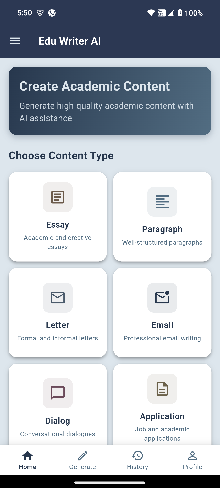

# EduWriterAI

An AI-powered educational writing assistant built with Flutter that helps students generate high-quality academic content across multiple categories.

## 🎯 Features

- **Multiple Content Types**: Generate essays, paragraphs, letters, emails, dialogues, applications, stories, and reports
- **Educational Focus**: Designed specifically for school and college students
- **Content History**: Save and manage all your generated content with Firebase integration
- **Cross-Platform**: Available on Android, iOS, Web, Windows, macOS, and Linux
- **Professional UI**: Clean, educational-themed interface with accessibility in mind
- **PDF Export**: Download your generated content as PDF files

## 📱 Screenshots

  
  
  
  
 
  
  

## 🛠️ Built With

- **Flutter** - Cross-platform UI framework
- **Firebase** - Backend services and authentication
- **Material Design** - UI components and theming
- **Backend: FastAPI** - API for AI integration
### github link for the backend project: [https://github.com/mahdi-islam-pranto/EduWriterAI-backend/]

- **Langchain** - For AI integration

## Target Audience

This app is designed for:
- High school students
- College students
- Academic writers
- Anyone looking to improve their writing skills

##  Contributing

Contributions are welcome! Please feel free to submit a Pull Request.

